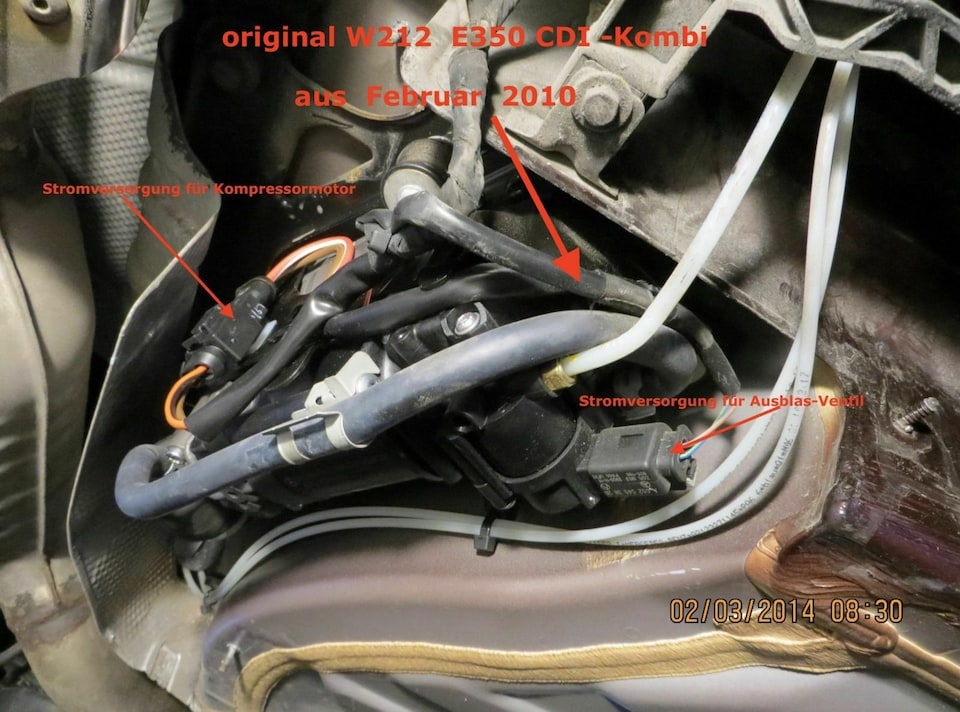
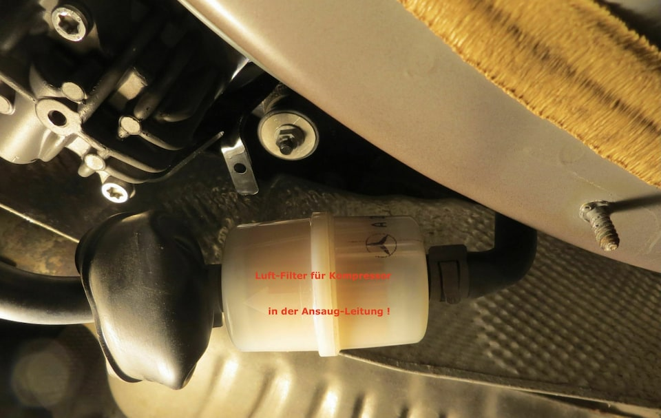
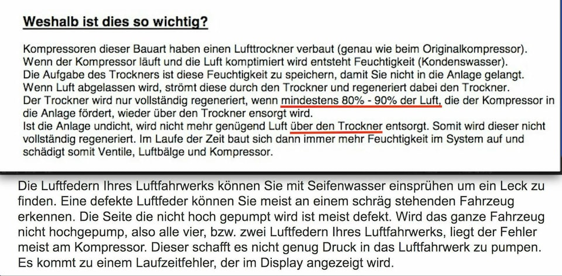
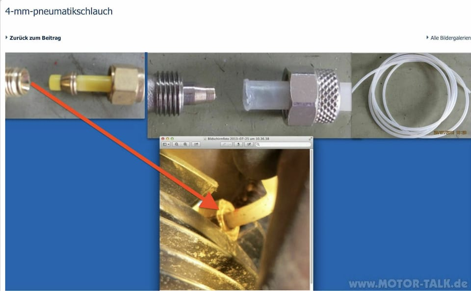

# Reparatur/Fehlersuche

## Differenzdrucksensor DPF
[youtube.com: Differenzdrucksensor tauschen](https://www.youtube.com/watch?v=ZGwmdF0d84M)

## Kettenspanner Steuerkette
[youtube.com: Unterschiede im Geräuschniveu](https://www.youtube.com/watch?v=f6b72yEAJ3E) 
[youtube.com: Spannerwechsel](https://www.youtube.com/watch?v=sUEt3YL5Tnk)

## Getriebelager
[youtube.com: Getriebelager wechseln](https://www.youtube.com/watch?v=Z9urJTzgEVQ)

## Motorlager
[youtube.com: Motorlager tauschen](https://www.youtube.com/watch?v=5hKLtuKEQNM&t=116s)

## Steuerkette
[youtube.com: Steuerkette tauschen](https://www.youtube.com/watch?v=l3aT2sRBUTg)

## Luftfederung

### Fahrzeug Sackt ab

#### Kompressor

#### Luftfilter des Kompressors

#### Pneumatikanschlüße an Federbalg

### Federbalg tauschen
[youtube.com: Federbalg tauschen](https://www.youtube.com/watch?v=-BML9WtLDb)